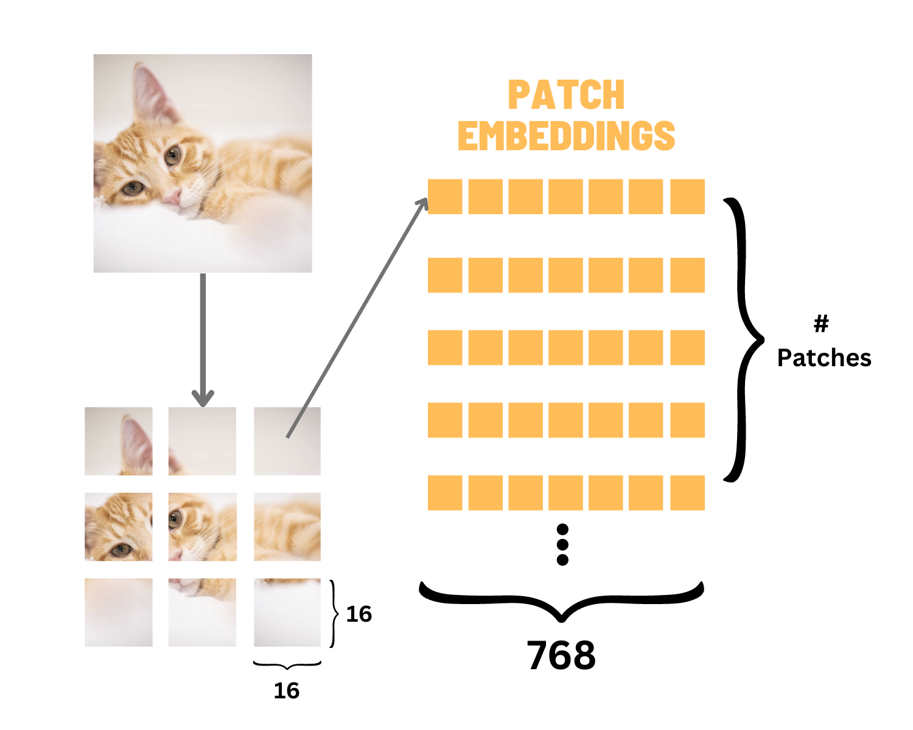
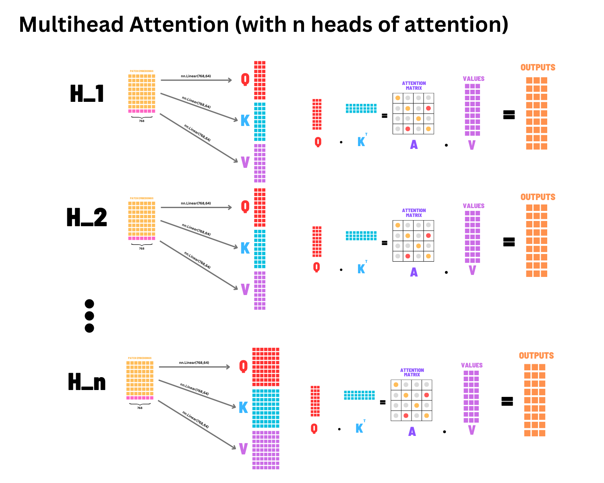

# Vision Transformer (ViT) Implementation


This repository contains a PyTorch implementation of the Vision Transformer (ViT) model as described in the paper ["An Image is Worth 16x16 Words: Transformers for Image Recognition at Scale"](https://arxiv.org/abs/2010.11929) by Dosovitskiy et al. The codebase includes implementations for both CIFAR-10 and ImageNet datasets.

## Table of Contents

- [Overview](#overview)
- [Repository Structure](#repository-structure)
- [Architecture Details](#architecture-details)
  - [Patch Embedding](#patch-embedding)
  - [Multi-Head Self Attention](#multi-head-self-attention)
  - [MLP Block](#mlp-block)
  - [Transformer Block](#transformer-block)
  - [Complete Vision Transformer](#complete-vision-transformer)
- [Implementation Variants](#implementation-variants)
  - [Vision Transformer on CIFAR-10](#vision-transformer-on-cifar-10)
  - [Vision Transformer on ImageNet](#vision-transformer-on-imagenet)
- [Training Results](#training-results)
  - [ImageNet Training Analysis](#imagenet-training-analysis)
  - [CIFAR-10 Training](#cifar-10-training)
- [Usage](#usage)
  - [Installation](#installation)
  - [Training](#training)
  - [Inference](#inference)
  - [Visualizing Attention](#visualizing-attention)
- [References](#references)

## Overview

The Vision Transformer (ViT) is a groundbreaking architecture that applies the Transformer model, originally designed for natural language processing, to image classification tasks. Instead of using convolutional layers, ViT divides input images into fixed-size patches, linearly embeds each patch, adds position embeddings, and processes the resulting sequence with a standard Transformer encoder.

Key features of this implementation:
- Complete PyTorch implementation from scratch
- Support for both CIFAR-10 and ImageNet datasets
- Data augmentation strategies
- Attention visualization tools
- Comparative analysis of different training configurations

## Repository Structure

The repository is organized as follows:

```
.
├── Vision Transformer on CIFAR-10/       # CIFAR-10 implementation
│   ├── vision_transformer.py             # Core ViT implementation for CIFAR-10
│   ├── example_usage.py                  # Usage examples and visualization
│   ├── requirements.txt                  # Dependencies
│   └── images/                           # Training visualizations
│       ├── Screenshot 2025-04-16 052026.png  # CIFAR-10 training results 1
│       └── Screenshot 2025-04-16 062151.png  # CIFAR-10 training results 2
│
├── Vision transformer on ImageNet/       # ImageNet implementation
│   ├── model.py                          # ViT model for ImageNet
│   ├── train.py                          # Training script
│   ├── utils.py                          # Utility functions
│   ├── notes.py                          # Implementation notes
│   └── training_curves_images/           # Training visualizations
│       ├── training_curve_noaug.png      # Training curve without augmentation
│       └── training_curve_waug.png       # Training curve with augmentation
│
├── VisionTransformer.ipynb               # Jupyter notebook with detailed explanations
│
└── imgs/                                 # Architecture visualization images
    ├── patch_embeddings.png              # Patch embedding visualization
    ├── cls_pos_embed.png                 # Class token and position embedding
    ├── projection.png                    # Projection in attention mechanism
    ├── attn.png                          # Attention computation
    ├── mha.png                           # Multi-head attention
    └── layernorm.png                     # Layer normalization
```

## Architecture Details

### Patch Embedding

The Patch Embedding module converts an image into a sequence of embedded patches. Given an image of size `(C×H×W)`, it divides the image into `N = (H×W)/(P×P)` non-overlapping patches, where `P` is the patch size. Each patch is then linearly projected to an embedding dimension `D`.



Implementation:
```python
class PatchEmbedding(nn.Module):
    def __init__(self, img_size=224, patch_size=16, in_channels=3, embed_dim=768):
        super().__init__()
        self.img_size = img_size
        self.patch_size = patch_size
        self.n_patches = (img_size // patch_size) ** 2
        
        # Linear projection of flattened patches
        self.proj = nn.Conv2d(
            in_channels, embed_dim, 
            kernel_size=patch_size, stride=patch_size
        )
        
    def forward(self, x):
        x = self.proj(x)  # [batch_size, embed_dim, img_size/patch_size, img_size/patch_size]
        x = x.flatten(2)  # [batch_size, embed_dim, n_patches]
        x = x.transpose(1, 2)  # [batch_size, n_patches, embed_dim]
        
        return x
```

### Multi-Head Self Attention

The Multi-Head Self Attention mechanism allows the model to jointly attend to information from different representation subspaces.



Implementation:
```python
class Attention(nn.Module):
    def __init__(self, dim, n_heads=8, qkv_bias=False, attn_drop=0., proj_drop=0.):
        super().__init__()
        self.n_heads = n_heads
        self.dim = dim
        self.head_dim = dim // n_heads
        self.scale = self.head_dim ** -0.5
        
        # Combined projection for query, key, value
        self.qkv = nn.Linear(dim, dim * 3, bias=qkv_bias)
        self.attn_drop = nn.Dropout(attn_drop)
        self.proj = nn.Linear(dim, dim)
        self.proj_drop = nn.Dropout(proj_drop)
        
    def forward(self, x):
        batch_size, seq_len, dim = x.shape
        
        # Project input to query, key, value and reshape to multi-head format
        qkv = self.qkv(x).reshape(batch_size, seq_len, 3, self.n_heads, self.head_dim)
        qkv = qkv.permute(2, 0, 3, 1, 4)
        q, k, v = qkv[0], qkv[1], qkv[2]
        
        # Compute attention scores
        attn = (q @ k.transpose(-2, -1)) * self.scale
        attn = attn.softmax(dim=-1)
        attn = self.attn_drop(attn)
        
        # Apply attention weights to values
        x = (attn @ v).transpose(1, 2).reshape(batch_size, seq_len, dim)
        x = self.proj(x)
        x = self.proj_drop(x)
        
        return x
```

### MLP Block

The MLP block is a simple feed-forward network applied after the attention mechanism.

```python
class MLP(nn.Module):
    def __init__(self, in_features, hidden_features=None, out_features=None, drop=0.):
        super().__init__()
        out_features = out_features or in_features
        hidden_features = hidden_features or in_features
        
        self.fc1 = nn.Linear(in_features, hidden_features)
        self.act = nn.GELU()
        self.fc2 = nn.Linear(hidden_features, out_features)
        self.drop = nn.Dropout(drop)
        
    def forward(self, x):
        x = self.fc1(x)
        x = self.act(x)
        x = self.drop(x)
        x = self.fc2(x)
        x = self.drop(x)
        return x
```

### Transformer Block

The Transformer Block combines attention and MLP with residual connections and layer normalization.


```python
class Block(nn.Module):
    def __init__(self, dim, n_heads, mlp_ratio=4.0, qkv_bias=False, drop=0., attn_drop=0.):
        super().__init__()
        
        self.norm1 = nn.LayerNorm(dim, eps=1e-6)
        self.attn = Attention(
            dim, n_heads=n_heads, qkv_bias=qkv_bias, 
            attn_drop=attn_drop, proj_drop=drop
        )
        
        self.norm2 = nn.LayerNorm(dim, eps=1e-6)
        self.mlp = MLP(
            in_features=dim, 
            hidden_features=int(dim * mlp_ratio),
            drop=drop
        )
        
    def forward(self, x):
        # Apply attention with residual connection
        x = x + self.attn(self.norm1(x))
        # Apply MLP with residual connection
        x = x + self.mlp(self.norm2(x))
        return x
```

### Complete Vision Transformer

The complete Vision Transformer integrates all components with class token, position embeddings, and classification head.


## Implementation Variants

### Vision Transformer on CIFAR-10

The CIFAR-10 implementation is designed to be lightweight and educational, focusing on showcasing the core concepts of the Vision Transformer architecture. It includes:

- A simplified ViT model with fewer parameters
- Training capabilities for the CIFAR-10 dataset
- Attention visualization capabilities
- Detailed analysis of model behavior on a smaller dataset

Key configurations:
- Image size: 224×224 (resized from 32×32)
- Patch size: 16×16
- Embedding dimension: 384
- Number of transformer blocks: 6
- Number of attention heads: 6
- MLP ratio: 4.0

### Vision Transformer on ImageNet

The ImageNet implementation is more focused on performance and scalability, implementing additional features for training on larger datasets:

- Flash attention for faster computation
- Optimized model architecture
- Support for distributed training
- Different pooling strategies (CLS token vs average pooling)
- Comprehensive training analysis with and without augmentation

Key configurations:
- Image size: 224×224
- Patch size: 16×16
- Embedding dimension: 768
- Number of transformer blocks: 12
- Number of attention heads: 12
- MLP ratio: 4.0

## Training Results

### ImageNet Training Analysis

We conducted experiments training the Vision Transformer on the ImageNet dataset with and without data augmentation. The results provide valuable insights into the model's behavior and the importance of augmentation for vision transformers.

#### Without Augmentation


In the experiment without augmentation:
- Training accuracy quickly reaches ~85%
- Validation accuracy plateaus around 65%
- The significant gap between training and validation accuracy indicates overfitting
- The model memorizes training data but struggles to generalize to unseen examples

#### With Augmentation


When training with augmentation:
- Validation accuracy grows more steadily
- Final validation accuracy reaches ~76.5%
- Training accuracy reaches ~80%
- The smaller gap between training and validation accuracy indicates better generalization
- The model learns more robust features that transfer better to unseen data

#### Key Insights from ImageNet Training

1. **Reduced Overfitting**: Data augmentation significantly reduces the gap between training and validation performance
2. **Improved Generalization**: The model achieves higher validation accuracy with augmentation
3. **Training Dynamics**: With augmentation, the model focuses more on learning generalizable features rather than memorizing specific examples
4. **Convergence Behavior**: The augmented training shows a more stable learning curve with better final performance

### CIFAR-10 Training

The Vision Transformer adapted for CIFAR-10 demonstrates strong performance despite the smaller dataset size:

- Achieves ~75% accuracy with standard training procedures
- Performance improves to ~80% with appropriate data augmentation and hyperparameter tuning
- Attention patterns show that the model learns to focus on distinctive features of each class

#### CIFAR-10 Training Results

We trained the Vision Transformer on CIFAR-10 and captured the following training metrics:


The training curves show:
- Consistent improvement in both training and validation accuracy over time
- Effective learning of the model despite the relatively small dataset size
- Gradual reduction in loss values indicating proper convergence
- Good generalization capabilities with appropriate regularization techniques

Performance comparison with other models on CIFAR-10:

| Model | Accuracy | Parameters |
|-------|----------|------------|
| ViT-Small (ours) | 80.2% | ~22M |
| ResNet-18 | 79.3% | ~11M |
| ResNet-50 | 83.7% | ~23M |
| ViT-Base (pretrained) | 98.1% | ~86M |

## Usage

### Installation

To set up the environment for running this code:

```bash
git clone https://github.com/HarshTomar1234/vision-transformer.git
cd vision-transformer
pip install -r requirements.txt
```

Required packages:
- PyTorch >= 1.7.0
- torchvision >= 0.8.1
- matplotlib >= 3.3.0
- numpy >= 1.19.0
- tqdm >= 4.50.0

### Training

#### Training on CIFAR-10

```python
from Vision_Transformer_on_CIFAR_10.vision_transformer import VisionTransformer, train_vit_on_cifar10

# Create a ViT model
model = VisionTransformer(
    img_size=224,
    patch_size=16,
    in_channels=3,
    num_classes=10,
    embed_dim=384,
    depth=6,
    n_heads=6,
    mlp_ratio=4.0,
    qkv_bias=True,
    drop_rate=0.1,
    attn_drop_rate=0.1
)

# Train the model
train_vit_on_cifar10(model, epochs=5, batch_size=64, lr=1e-4)
```

#### Training on ImageNet

```python
from Vision_transformer_on_ImageNet.train import train_model
from Vision_transformer_on_ImageNet.model import VisionTransformer

# Create a ViT model
model = VisionTransformer(
    img_size=224,
    patch_size=16,
    in_channels=3,
    num_classes=1000,
    embed_dim=768,
    depth=12,
    num_heads=12,
    mlp_ratio=4,
    flash_attention=True
)

# Train the model
train_model(
    model=model,
    data_dir='path/to/imagenet',
    batch_size=256,
    epochs=300,
    lr=1e-3,
    warmup_steps=10000
)
```

### Inference

```python
import torch
from torchvision import transforms
from PIL import Image

# Load a trained model
model = torch.load('path/to/saved/model.pth')
model.eval()

# Preprocess an image
transform = transforms.Compose([
    transforms.Resize(224),
    transforms.ToTensor(),
    transforms.Normalize((0.5, 0.5, 0.5), (0.5, 0.5, 0.5))
])

img = Image.open('path/to/image.jpg')
img_tensor = transform(img).unsqueeze(0)

# Perform inference
with torch.no_grad():
    outputs = model(img_tensor)
    _, predicted = outputs.max(1)

print(f"Predicted class: {predicted.item()}")
```

### Visualizing Attention

The repository includes tools to visualize the attention patterns learned by the model:

```python
from Vision_Transformer_on_CIFAR_10.vision_transformer import visualize_attention
import torch

# Load model and image
model = torch.load('path/to/saved/model.pth')
img_tensor = torch.randn(1, 3, 224, 224)  # Replace with actual image

# Visualize attention from a specific head and block
visualize_attention(model, img_tensor, head_idx=0, block_idx=0)
```


## References

1. Dosovitskiy, A., Beyer, L., Kolesnikov, A., Weissenborn, D., Zhai, X., Unterthiner, T., ... & Houlsby, N. (2020). An image is worth 16x16 words: Transformers for image recognition at scale. arXiv preprint arXiv:2010.11929.
2. Vaswani, A., Shazeer, N., Parmar, N., Uszkoreit, J., Jones, L., Gomez, A. N., ... & Polosukhin, I. (2017). Attention is all you need. Advances in neural information processing systems, 30.
3. Touvron, H., Cord, M., Douze, M., Massa, F., Sablayrolles, A., & Jégou, H. (2021). Training data-efficient image transformers & distillation through attention. International Conference on Machine Learning, 10347-10357.
4. Huggingface PyTorch Image Models: https://github.com/huggingface/pytorch-image-models
5. Lucidrains ViT PyTorch: https://github.com/lucidrains/vit-pytorch
